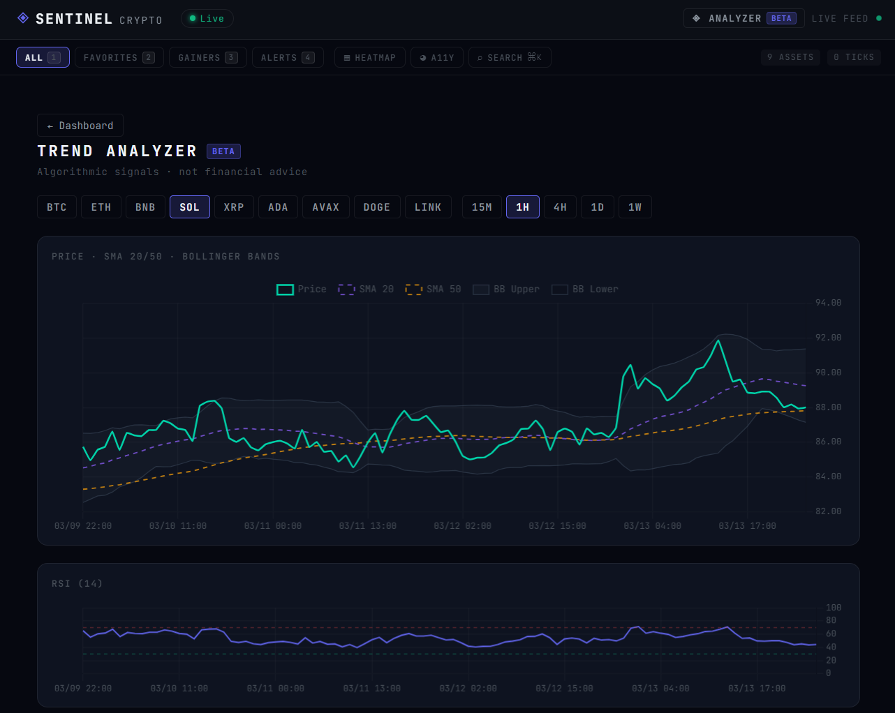
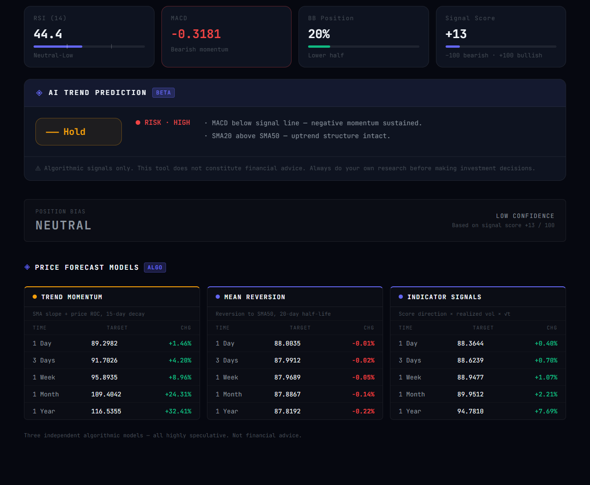

# Sentinel Crypto

Real-time cryptocurrency market dashboard built to handle **1,000+ price updates per second** while maintaining a **60 FPS** UI.


---

## Trend Analyzer *(Beta)*

A dedicated `/graph` page with algorithmic technical analysis and three independent price forecast models.





### Indicators
| Indicator | Details |
|---|---|
| RSI (14) | Wilder smoothing, oversold/overbought zones |
| MACD | 12/26/9 EMA crossover, bullish/bearish momentum |
| Bollinger Bands | 20-period, 2σ — price position + band width volatility |
| SMA 20 / 50 | Golden Cross / Death Cross detection |

### Signal Engine
Multi-factor score (−100 → +100) mapped to **Strong Buy / Buy / Hold / Sell / Strong Sell** with a **Low / Medium / High** risk rating based on volatility and signal conflict.

### Position Bias
Derived from the signal score — **Long / Short / Neutral** with a confidence level.

### Price Forecast Models
Three independent algorithms run in parallel and can disagree with each other:

| Model | Algorithm |
|---|---|
| **Trend Momentum** | Blends SMA20 slope + price rate-of-change, extrapolated with a 15-day half-life so trends fade rather than run forever |
| **Mean Reversion** | Projects price drifting back toward SMA50 using exponential decay (20-day half-life — 50% of the gap closes in ~20 days) |
| **Indicator Signals** | Composite signal score drives direction; realized daily volatility × √t drives magnitude |

Supports 9 symbols (BTC, ETH, BNB, SOL, XRP, ADA, AVAX, DOGE, LINK) and 5 intervals (15M / 1H / 4H / 1D / 1W) via the Binance public REST API.

> ⚠ Algorithmic signals only — not financial advice.

---

## Deploy

### One-click deploy to Render (free)

[](https://render.com/deploy?repo=https://github.com/ugniusado/sentinel-crypto)

1. Click the button above (or go to [render.com](https://render.com) → New → Web Service → connect this repo)
2. Render auto-detects `render.yaml` — just click **Deploy**
3. First build takes ~5 minutes (downloads .NET 9 SDK + ML.NET packages)
4. Your app is live at `https://sentinel-crypto.onrender.com` (or similar)

> **Free tier note:** Render spins the service down after 15 minutes of inactivity. First request after sleep takes ~30 seconds to wake up. Upgrade to the $7/mo Starter plan to keep it always-on.

### Self-hosted via Docker

```bash
docker-compose up --build
# App → http://localhost:5000
```

---

## Architecture

```
Binance WebSocket
      │  raw ticks
      ▼
Channel<PriceUpdate>          ← unbounded buffer, never drops messages
      │  drained every 100ms
      ▼
PriceAggregatorService        ← keeps latest price, computes volatility
      │  AggregatedUpdate
      ▼
SignalR Hub (Redis backplane)  ← broadcasts to all connected clients
      │
      ▼
Blazor WASM Client
  PriceStateService            ← Dictionary<string, CoinModel>
  CoinCard.ShouldRender()      ← only re-renders on >0.01% price change
```

### Server — ASP.NET Core 9

| Component | Purpose |
|---|---|
| `BinanceWebSocketService` | BackgroundService — streams 10 symbols from Binance combined feed |
| `PriceChannelService` | `Channel<PriceUpdate>.CreateUnbounded()` — decouples socket from processor |
| `PriceAggregatorService` | 100ms `PeriodicTimer` — aggregates ticks, broadcasts via SignalR |
| `CryptoHub` | Strongly-typed `Hub<ICryptoClient>` — sends initial state on connect |

### Client — Blazor WebAssembly 9

| Component | Purpose |
|---|---|
| `PriceStateService` | Singleton state store, fires `OnPricesUpdated` |
| `CryptoSignalRService` | Manages hub connection with exponential reconnect back-off |
| `DashboardStateService` | View mode, heatmap, color-blind toggle, favorites |
| `CoinCard` | `ShouldRender()` gate + odometer digit-flip animation |
| `SparklineChart` | SVG area chart, 30s samples, 15min history |
| `AnimatedPrice` | Digit-slot odometer — rolls up on price rise, down on fall |
| `CommandPalette` | CMD+K fuzzy coin search |
| `GlobalShortcuts` | JS interop for keyboard shortcuts |
| `BinanceHistoricalService` | Fetches OHLCV klines from Binance REST API |
| `IndicatorService` | SMA, EMA, RSI, MACD, Bollinger Bands + trend prediction |

---

## Features

### Performance
- **Channel buffer** — socket spikes never block the aggregator
- **`ShouldRender()` optimization** — coin cards skip re-render unless price changed >0.01% or panic state flipped
- **`font-variant-numeric: tabular-nums`** — prices don't jitter horizontally as digits change

### UI / UX
- **Odometer digit animation** — each digit rolls up or down independently on price change (600ms cubic-bezier)
- **Live SVG sparklines** — 15-minute price history on medium and large cards
- **Volume profile bar** — right-edge bar shows relative volume vs 20-sample rolling average
- **Volatility glow** — cards emit a radial green/red aura that intensifies with price volatility
- **Panic mode** — if a coin drops >3% in 5 minutes, the card gets a pulsing red glow + "HIGH VOL" badge
- **Heatmap overlay** — toggle card backgrounds to solid green/red based on 24h change intensity
- **Glassmorphism** — `backdrop-filter: blur(10px)` on all cards
- **Skeleton screens** — shimmer placeholders while WebSocket connects
- **Bento grid** — BTC/ETH take 2×2 slots; mid-caps 1×2; alts 1×1
- **Trend Analyzer** — Chart.js price chart with SMA/BB overlays + RSI sub-chart

### Accessibility
- **Color-blind mode** — swaps Green/Red for Blue/Orange via CSS custom property override

### Navigation
| Shortcut | Action |
|---|---|
| `1` | All coins |
| `2` | Favorites |
| `3` | Top gainers |
| `4` | Panic alerts |
| `⌘/Ctrl + K` | Open command palette |
| `Esc` | Close command palette |

---

## Running Locally

**Prerequisites:** .NET 9 SDK

```bash
cd src/Server
dotnet run
# → http://localhost:5000        (app)
# → http://localhost:5000/health (health check)
```

The Server hosts the Blazor WASM client directly — one command, one port, no second terminal.

> **Standalone client dev** (optional): `cd src/Client && dotnet run` still works on `:5173` for frontend-only iteration.

---

## Docker (full stack)

Spins up the app, Redis backplane, and Jaeger tracing in one command.

```bash
docker-compose up --build
```

| Service | URL |
|---|---|
| App | http://localhost:5000 |
| Jaeger UI | http://localhost:16686 |
| Redis | localhost:6379 |

---

## Health Check

```
GET http://localhost:5000/health
```

```json
{
  "status": "Healthy",
  "checks": [
    { "name": "self",              "status": "Healthy" },
    { "name": "binance-websocket", "status": "Healthy", "description": "Receiving data for 10 symbols" },
    { "name": "redis",             "status": "Healthy" }
  ]
}
```

---

## Project Structure

```
sentinel-crypto/
├── docker-compose.yml
├── docs/
│   ├── trend-analyzer-charts.png   ← Charts + indicators screenshot
│   └── trend-analyzer-forecast.png ← 3-model forecast screenshot
├── src/
│   ├── Server/
│   │   ├── Hubs/               SignalR hub + client interface
│   │   ├── Models/             PriceUpdate, AggregatedUpdate, BinanceTicker
│   │   ├── Services/           Channel buffer, WebSocket worker, aggregator
│   │   └── Program.cs          DI, CORS, health checks, OTLP tracing
│   └── Client/
│       ├── Components/         CoinCard, HeatmapGrid, SparklineChart,
│       │                       CommandPalette, Toolbar, GlobalShortcuts,
│       │                       AnimatedPrice
│       ├── Models/             CoinModel, KlineData
│       ├── Pages/              Index (dashboard), CryptoGraph (trend analyzer)
│       ├── Services/           PriceStateService, CryptoSignalRService,
│       │                       DashboardStateService, BinanceHistoricalService,
│       │                       IndicatorService
│       └── wwwroot/
│           ├── css/app.css     Mission Control dark UI
│           └── js/app.js       Keyboard shortcut interop + Chart.js wrappers
```

---

## License

MIT
